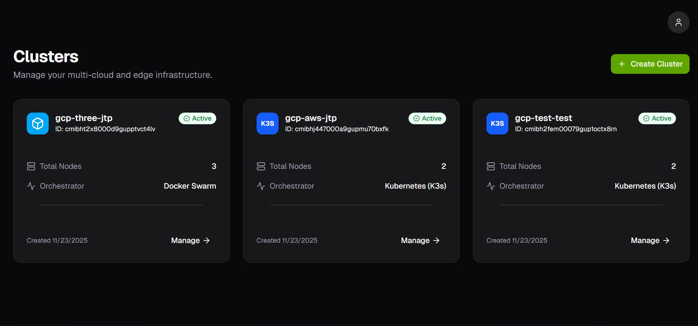
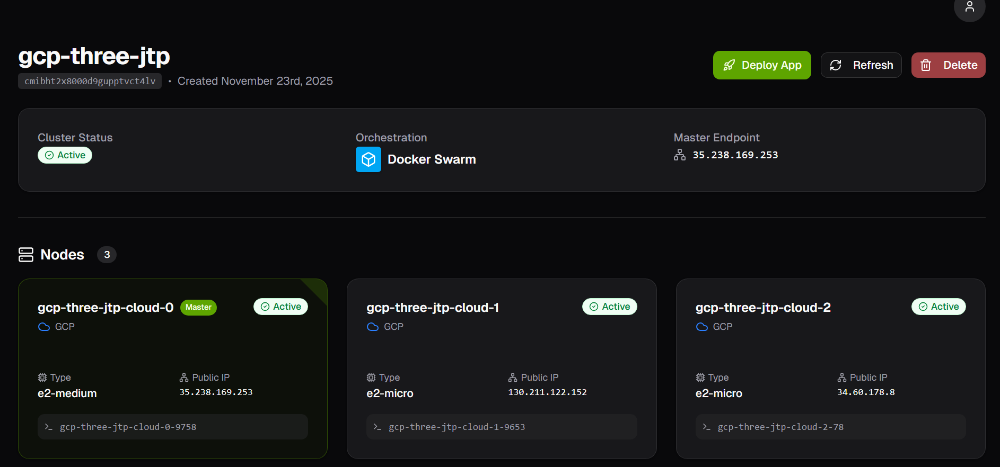
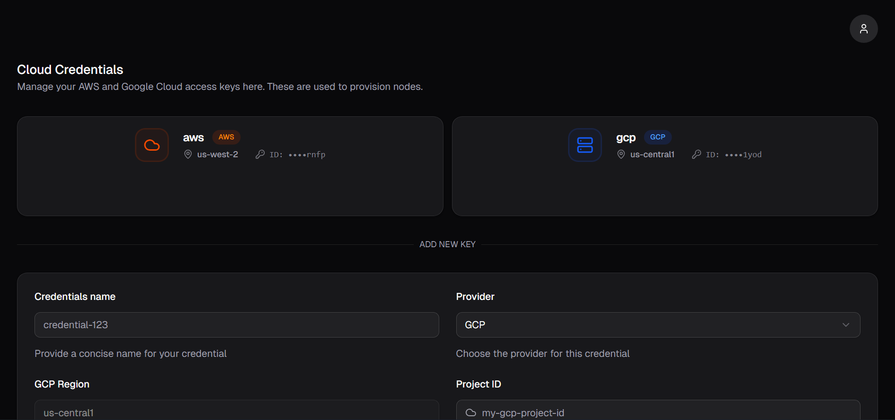
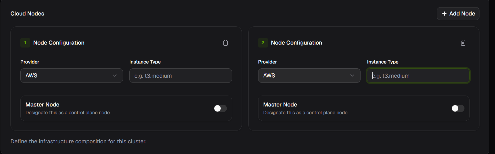

# ☁️ NebulOuS: Multi-Cloud & Edge Cluster Manager

[](https://hackeps.com/)
[](https://create.t3.gg/)
[](./LICENSE)

> **2nd Prize Winner at HackEPS 2025 (Eurecat Challenge)** > A platform to seamlessly deploy and manage hybrid computing clusters across **AWS**, **Google Cloud Platform**, and **Edge devices**.

---

## 📸 Screenshots

| Dashboard View | Cluster Details |
|:---:|:---:|
|  |  |

| Cloud Credentials | Cluster Creation |
|:---:|:---:|
|  |  |

---

## 📖 The Story: The 12-Hour Pivot

We entered HackEPS 2025 with a plan: build a high-performance backend using **Go**, **Connect-Go**, and **Protocol Buffers** for end-to-end type safety.

However, at the **12-hour mark** (halfway through the hackathon), we hit a wall. The complexity of implementing strict Protobuf definitions while racing against the clock meant we had a great architecture diagram, but zero working features.

**We made a critical decision:** We scrapped the entire codebase and started from scratch using the **T3 Stack** (Next.js + tRPC). This allowed us to iterate at lightning speed, leveraging full-stack type safety without the boilerplate, and ultimately deliver a winning product in the remaining 12 hours.

---

## 🚀 Features

* **Multi-Cloud Provisioning:** Create Virtual Machines on **AWS (EC2)** and **Google Cloud (Compute Engine)** from a single interface.
* **Orchestration Agnostic:** Designed to bootstrap nodes for **Docker Swarm**, or **K3s** (Kubernetes).
* **Real-time Status:** Tracks the provisioning lifecycle (Provisioning -> SSH Check -> Active).
* **Credential Management:** Securely store and manage API keys for multiple cloud providers.
* **SSH Polling Mechanism:** Automatically verifies node health and connectivity upon creation.

---

## 🛠️ Tech Stack

This project was built using the **T3 Stack** philosophy:

* **Framework:** [Next.js](https://nextjs.org/) (App Router)
* **Language:** TypeScript
* **API/Communication:** [tRPC](https://trpc.io/) (End-to-end type safety)
* **Database:** PostgreSQL (via [Prisma ORM](https://www.prisma.io/))
* **Styling:** [Tailwind CSS](https://tailwindcss.com/) + [ShadcnUI](https://ui.shadcn.com/)
* **Cloud SDKs:**
    * `@aws-sdk/client-ec2`
    * `@google-cloud/compute`
* **Infrastructure:** Hosted on a [Clouding.io](https://clouding.io/) VPS.

---

## 🏗️ Architecture & Workflow

Since we didn't have time to implement a complex asynchronous queue system (Redis/BullMQ) during the hackathon, we devised a robust polling architecture:

```mermaid
sequenceDiagram
    participant User
    participant NextJS_Backend
    participant Database
    participant AWS_GCP
    
    User->>NextJS_Backend: Create Cluster (Request)
    NextJS_Backend->>Database: Create "Pending" Entry
    NextJS_Backend->>AWS_GCP: API Call to Provision VM
    AWS_GCP-->>NextJS_Backend: VM Created (IP Assigned)
    NextJS_Backend->>Database: Update IP & Status "Booting"
    
    loop SSH Polling
        NextJS_Backend->>AWS_GCP: Attempt SSH Connection
        AWS_GCP-->>NextJS_Backend: Connection Success?
    end
    
    NextJS_Backend->>Database: Update Status "Active"
    NextJS_Backend-->>User: Cluster Ready
````

-----

## 🔮 Future Improvements

Given the 24-hour time constraint, there were features we designed but couldn't fully implement:

1.  **AI Orchestration (The "NebulOuS" Challenge):**

      * *Goal:* Integrate an LLM to interpret natural language requests (e.g., "I need a low-latency cluster in Europe for under €5/day") and automatically select the best provider/region.
      * *Status:* Logic designed, but not connected to the live pricing API.

2.  **Asynchronous Job Queue:**

      * *Improvement:* Replace the long-running HTTP requests with **Redis + BullMQ**. This would allow the backend to handle provisioning in the background without blocking the UI.

3.  **WebSockets:**

      * *Improvement:* Use WebSockets to push state updates to the frontend instead of client-side refreshing.

-----

## 💻 Getting Started

### Prerequisites

  * Node.js 18+
  * PostgreSQL Database

### Installation

1.  **Clone the repo**

    ```bash
    git clone https://github.com/jtayped/hackeps2025-eurecat.git
    cd hackeps2025-eurecat
    ```

2.  **Install dependencies**

    ```bash
    npm install
    ```

3.  **Environment Setup**
    Create a `.env` file based on `.env.example`:

    ```env
    cp .env.local .env
    ```

4.  **Run the database migration**

    ```bash
    npm run db:migrate
    ```

5.  **Start the development server**

    ```bash
    npm run dev
    ```

-----

## 👥 Authors

  * **Joel Taylor** - [LinkedIn](https://www.linkedin.com/in/jtayped/)
  * **Maria Aliet** - [LinkedIn](https://www.linkedin.com/in/maria-aliet-060bb72aa/)

-----
